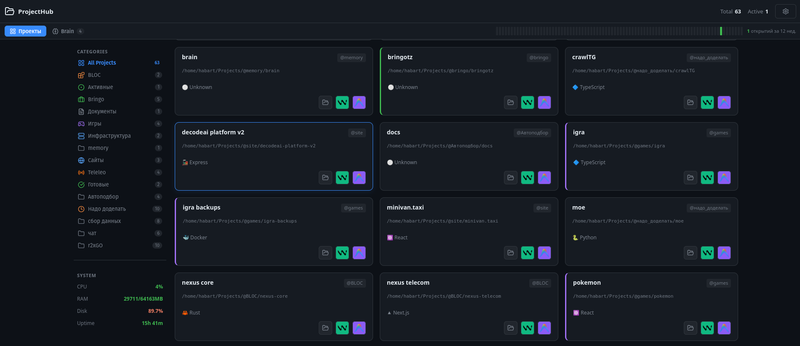
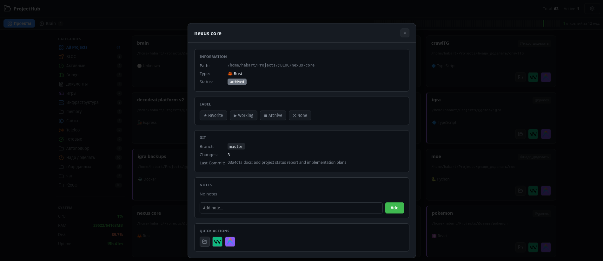
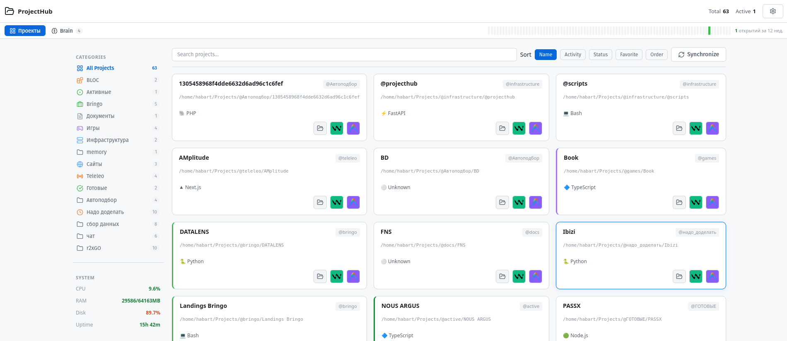

# 🚀 ProjectHub

> **Your Local Development Workspace Navigator**
>
> All your projects in one place. One-click launch in any editor. Full system awareness.

[](https://python.org)
[](https://fastapi.tiangolo.com)
[](LICENSE)
[](https://modelcontextprotocol.io)

**[English](#-why-projecthub)** | **[Русский](#-зачем-нужен-projecthub)** | **[中文](#-为什么选择-projecthub)**

<p align="center">
  
</p>

---

## ✨ Why ProjectHub?

**The Problem:** You have dozens of projects scattered across your machine. Switching between them is tedious. Remembering what's where is hard. Opening the right editor with the right project takes too many clicks.

**The Solution:** ProjectHub — a lightweight dashboard that auto-discovers all your projects and opens them in one click. Plus, AI agents (Claude Code, Windsurf/Cascade) can query your projects, dependencies, and infrastructure via the built-in MCP server.

### Key Features

| Feature | What it does |
|---------|-------------|
| 📂 **Smart Categories** | Auto-detects `@folders` in `~/Projects/`, identifies container dirs (groups of independent projects) vs monorepos |
| 🖥️ **Any Editor Launch** | Windsurf, VS Code, Cursor, Antigravity — configurable buttons with icons |
| 🤖 **MCP Server for AI** | AI agents get project list, dependencies, Git status, Docker — via Model Context Protocol |
| 🏷️ **Labels & Notes** | Favorite ★, Working ▶, Archive ◼ — plus notes per project |
| 🌿 **Git Integration** | Branch, changes count, last commit — no more `cd && git status` |
| 🐳 **Docker Integration** | Container status per project |
| 🔍 **Instant Search** | 300ms debounced, searches names and paths |
| 🎨 **3 Themes** | GitHub Dark, GitHub Light, Midnight OLED |
| 🌍 **3 Languages** | English, Русский, 中文 |
| 🔒 **Security** | Command injection protection, editor validation, path traversal blocking |
| ⚡ **Works Offline** | All icons (Lucide) bundled locally, no CDN |

## 📸 Screenshots

### GitHub Dark Theme
<p align="center">
  
</p>

### Project Detail Modal
<p align="center">
  
</p>

### GitHub Light Theme
<p align="center">
  
</p>

## 🚀 Quick Start

```bash
git clone https://github.com/Habartru/projecthub.git
cd projecthub

python -m venv venv
source venv/bin/activate
pip install -r requirements.txt

python backend/main.py
# Opens at http://127.0.0.1:8472
```

### Autostart (Linux)

ProjectHub starts on login via `~/.config/autostart/projecthub.desktop`.
Log: `~/.config/projecthub/server.log`

## 🖥️ Dashboard

### Main View
- **Project Cards** — type, labels, tags, open count
- **Dynamic Sidebar** — categories auto-generated from `~/Projects/@*/`, with project counts
- **Sorting** — by name, activity, status, favorites, custom order
- **Quick Actions** — open in editor, open folder

### Project Detail Modal
- 📋 Path, type, status
- 📂 Category assignment (dropdown of all available categories)
- 🏷️ Labels: Favorite / Working / Archive
- 🌿 Git: branch, changes, last commit
- 🐳 Docker: container list and status
- 📝 Notes with timestamps
- ⚡ Launch buttons for all configured editors

### Category System

Categories are auto-detected from the filesystem structure:

```
~/Projects/
├── @active/          → category "Active"
├── @bringo/          → category "Bringo"
│   ├── chat/         → subcategory "chat" (6 independent projects inside)
│   ├── data-scraping/→ subcategory (6 projects)
│   └── DATALENS/     → regular project (subfolders are parts of one project)
├── @games/           → category "Games"
└── @todo/            → category "Todo"
```

**Auto-detection logic:**
- Folder with `@` in `~/Projects/` → category
- Subfolder without project markers but with 2+ independent projects → subcategory (container)
- Subfolder with parent-name children (`vivoai-server` in `VIVOAI/`) → monorepo, not container

Project categories can be changed manually via the modal dropdown.

### System Metrics (sidebar)
- CPU (updates every 5s)
- RAM (10s)
- Disk (60s)
- Uptime

### Settings (`/settings`)
- Editor management (add/remove/test)
- Theme selection
- Language selection
- Import/export settings

## 🤖 MCP Server (for AI Agents)

MCP (Model Context Protocol) lets AI agents (Claude Code, Windsurf/Cascade) query project information without direct filesystem access.

**Why:** When an AI agent works on one project, it can use MCP to learn about other projects — their dependencies, structure, Docker status. This prevents hallucinations ("what framework does project X use?") and helps the agent make decisions in the context of your entire infrastructure.

### MCP Tools

| Tool | Description |
|------|------------|
| `list_all_projects` | All projects with categories and types |
| `get_project_details` | Full info: path, type, venv, dependencies, git |
| `get_project_dependencies` | requirements.txt, package.json, Cargo.toml, etc. |
| `get_docker_status` | All Docker containers and their status |
| `get_databases` | PostgreSQL databases (OS user auth) |
| `get_system_status` | Overall system status: Docker, PostgreSQL, projects |
| `compare_projects` | Side-by-side comparison of two projects |
| `read_project_file` | Safe file reading (.env files blocked) |

### MCP Setup

```bash
# Install
cd mcp-server && ./install.sh

# Or manually for Claude Code:
claude mcp add project-context mcp-server/.venv/bin/python mcp-server/server.py
```

Supports: **Claude Code**, **Windsurf/Cascade**

### MCP Security
- Read-only access
- `.env` files blocked (only `.env.example`)
- Path traversal protection (`../`)
- File size limits
- Request logging

## 🔒 Security

- **Command injection** — all user strings in shell commands via `shlex.quote()`
- **Editor validation** — only commands from `editor_configs` table can be executed
- **Path traversal** — MCP server blocks access outside project directories
- **Pydantic validation** — all incoming data validated through models

## 🎨 Themes

| GitHub Dark (default) | GitHub Light | Midnight OLED |
|:---:|:---:|:---:|
| `#0d1117` bg | `#ffffff` bg | `#000000` bg |
| `#58a6ff` accent | `#0969da` accent | `#4da6ff` accent |

## 🛠️ Tech Stack

| Layer | Technology |
|-------|-----------|
| Backend | FastAPI + SQLite + Pydantic v2 |
| Frontend | Vanilla JS + Lucide Icons + CSS Custom Properties |
| MCP | Python MCP SDK 1.x |
| Integrations | Docker API, Git CLI, PostgreSQL |

## 📁 Project Structure

```
projecthub/
├── backend/
│   ├── main.py              # FastAPI server (API, security, categories)
│   └── static/
│       ├── index.html       # Dashboard (dynamic sidebar, modals)
│       ├── settings.html    # Settings (editors, themes, languages)
│       └── vendor/
│           └── lucide.js    # Icons (offline)
├── mcp-server/              # MCP server for AI agents
│   ├── server.py            # Scans ~/Projects/@*/*
│   ├── install.sh           # Setup script
│   └── requirements.txt
├── dashboard.sh             # Terminal dashboard (for Guake)
├── dev_aliases.sh           # Shell aliases
├── docs/
│   ├── assets/              # Screenshots
│   ├── PRD.md
│   ├── ROADMAP.md
│   └── TECH_SPEC.md
└── README.md
```

## API

### Projects
| Method | Endpoint | Description |
|--------|----------|------------|
| GET | `/api/projects` | List projects (filter by category, search, sort) |
| GET | `/api/projects/{id}` | Project details + notes |
| POST | `/api/projects/{id}/category` | Change category |
| POST | `/api/projects/{id}/label` | Set label |
| POST | `/api/projects/{id}/launch` | Launch in editor |
| POST | `/api/projects/{id}/notes` | Add note |
| POST | `/api/projects/sync` | Sync with filesystem |

### Categories
| Method | Endpoint | Description |
|--------|----------|------------|
| GET | `/api/categories` | All categories with project counts |
| POST | `/api/categories` | Create category |
| PUT | `/api/categories/{id}` | Update (name, icon, color) |
| DELETE | `/api/categories/{id}` | Delete category |

### Settings
| Method | Endpoint | Description |
|--------|----------|------------|
| GET | `/api/settings` | Current settings |
| GET | `/api/settings/editors` | Editor list |
| GET | `/api/settings/i18n/{lang}` | Translations |
| POST | `/api/settings/export` | Export to JSON |
| POST | `/api/settings/import` | Import from JSON |

## 📜 License

MIT License — see [LICENSE](LICENSE).

---

# 🇷🇺 Русский

## ✨ Зачем нужен ProjectHub?

**Проблема:** Десятки проектов в разных папках. Переключение — рутина. Вспомнить где что лежит — сложно. Открыть нужный редактор с нужным проектом — слишком много кликов.

**Решение:** ProjectHub — легковесный дашборд, который автоматически находит все проекты и открывает их в один клик. AI-агенты (Claude Code, Windsurf/Cascade) могут через встроенный MCP-сервер запрашивать информацию о проектах, зависимостях и инфраструктуре.

### Возможности
- 📂 Умные категории — автоопределение из `~/Projects/@*/` + контейнеры/монорепо
- 🖥️ Запуск в любом редакторе (Windsurf, VS Code, Cursor, Antigravity)
- 🤖 MCP-сервер — AI-агенты видят все проекты, зависимости, Docker, Git
- 🏷️ Лейблы (Избранное/В работе/Архив) + заметки
- 🌿 Git-статус (ветка, изменения, коммиты) без `cd && git status`
- 🐳 Docker-контейнеры для каждого проекта
- 🔍 Мгновенный поиск (debounced 300ms)
- 🎨 3 темы: GitHub Dark, Light, Midnight OLED
- 🔒 Безопасность: защита от command injection, валидация редакторов

### MCP-сервер для AI

MCP (Model Context Protocol) позволяет AI-агентам запрашивать информацию о проектах без прямого доступа к файловой системе. Когда агент работает с одним проектом, он может через MCP узнать о других — зависимости, структуру, Docker-статус. Это предотвращает галлюцинации и помогает принимать решения в контексте всей инфраструктуры.

8 инструментов: `list_all_projects`, `get_project_details`, `get_project_dependencies`, `get_docker_status`, `get_databases`, `get_system_status`, `compare_projects`, `read_project_file`

---

# 🇨🇳 中文

## ✨ 为什么选择 ProjectHub？

**问题：** 你有几十个项目散布在机器上。在它们之间切换很麻烦。记住什么在哪里更难。用正确的编辑器打开正确的项目需要太多点击。

**解决方案：** ProjectHub — 一个轻量级仪表板，自动发现所有项目并一键打开。AI 代理（Claude Code、Windsurf/Cascade）可以通过内置的 MCP 服务器查询项目、依赖项和基础设施信息。

### 功能特点
- 📂 智能分类 — 自动从 `~/Projects/@*/` 检测，识别容器目录和单体仓库
- 🖥️ 任意编辑器启动（Windsurf、VS Code、Cursor、Antigravity）
- 🤖 MCP 服务器 — AI 代理可查看所有项目、依赖、Docker、Git
- 🏷️ 标签（收藏/进行中/归档）+ 笔记
- 🌿 Git 集成（分支、更改、提交）
- 🐳 Docker 容器状态
- 🔍 即时搜索（300ms 防抖）
- 🎨 3 个主题：GitHub Dark、Light、Midnight OLED
- 🌍 3 种语言：English、Русский、中文
- 🔒 安全性：命令注入保护、编辑器验证、路径遍历拦截

### AI 的 MCP 服务器

MCP（模型上下文协议）让 AI 代理无需直接访问文件系统即可查询项目信息。当代理在处理一个项目时，可以通过 MCP 了解其他项目的依赖、结构和 Docker 状态，防止幻觉并帮助在整个基础设施的上下文中做出决策。

8 个工具：`list_all_projects`、`get_project_details`、`get_project_dependencies`、`get_docker_status`、`get_databases`、`get_system_status`、`compare_projects`、`read_project_file`

---

<p align="center">
  <a href="https://github.com/Habartru/projecthub/issues">Bug Report</a> &bull;
  <a href="https://github.com/Habartru/projecthub/discussions">Discussions</a>
</p>
