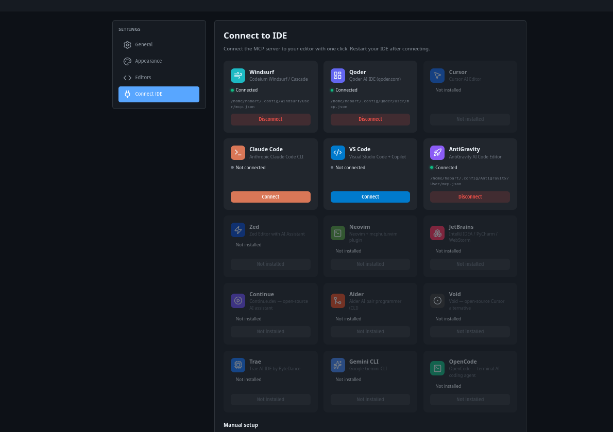

# ProjectHub

> Your self-hosted AI-powered developer hub. Manage all local projects, connect any AI IDE in one click, track Git & Docker, and give your AI agent persistent memory across sessions.

```bash
curl -fsSL https://raw.githubusercontent.com/Habartru/projecthub/main/install.sh | bash
```

Then open **http://localhost:8472**

[Русский](#русский) | [中文](#中文)

---

| Dark | Light |
|------|-------|
|  |  |

| Project Modal | Connect to IDE |
|---------------|----------------|
|  |  |

---

## Features

### Project Dashboard

- **Auto-discovery** — scans `~/Projects/` recursively, groups by `@category`
- **Smart cards** — language icon, open count, last-opened time-ago
- **LIVE badges** — animated green pulse on cards with running Docker containers, polls every 15s
- **Activity heatmap** — 84-day GitHub-style bar in sticky nav, tracks every project open
- **One-click launch** — open in Windsurf, VS Code, Cursor, or any custom editor
- **Sorting** — by name / activity / status / favorite / custom drag order
- **Labels** — Favorite / In Progress / Archive
- **Categories** — custom icons, colors, ordering

### Connect to IDE — one-click MCP setup

Go to **Settings → Connect IDE** — ProjectHub detects all installed AI editors and injects the MCP config automatically.


Supported editors (auto-detected):

| Editor | | Editor | |
|--------|-|--------|-|
| Windsurf | Codeium Cascade | Qoder | qoder.com |
| Cursor | Cursor AI | Claude Code | Anthropic CLI |
| VS Code | + Copilot | AntiGravity | antigravity.ai |
| Zed | AI Assistant | Neovim | mcphub.nvim |
| JetBrains | IDEA/PyCharm/WS | Continue | continue.dev |
| Aider | CLI pair programmer | Void | open-source Cursor alt |
| Trae | ByteDance IDE | Gemini CLI | Google CLI |
| OpenCode | terminal agent | | |

- Click **Connect** → MCP config injected automatically
- Click **Disconnect** → config removed cleanly
- Shows config file path for each IDE
- **Manual setup** JSON with copy button for unsupported editors

### AI Brain — persistent memory across sessions

The MCP server gives your AI agent a full memory of every project:

| Tool | What it does |
|------|-------------|
| `list_all_projects` | List all projects (prevents hallucinations) |
| `get_project_details` | Full info: git, docker, deps, type |
| `get_project_dependencies` | Dependencies for a specific project |
| `get_project_history` | Full git log + session insights for any time period |
| `get_project_context` | Load accumulated knowledge at session start |
| `log_session_insight` | Save decisions, bugs, patterns to knowledge base |
| `compile_knowledge` | Compile daily logs into permanent articles |
| `get_docker_status` | Live Docker container status |
| `get_databases` | PostgreSQL database list |
| `get_system_status` | Overall system health |
| `compare_projects` | Side-by-side project comparison |
| `read_project_file` | Read any project file (read-only, secure) |

#### `get_project_history` — the AI knows everything

```
# Full history (no limits)
get_project_history("myproject")

# Specific period
get_project_history("myproject", date_from="2026-01-01", date_to="2026-04-10")

# Only git, no memory
get_project_history("myproject", include_insights=false)

# Unlimited commits
get_project_history("myproject", max_commits=0)
```

Returns git commits + saved session insights merged chronologically.

- **Brain tab** in dashboard — browse knowledge articles, full-text search
- **Log Insight modal** — type, tags, content, without leaving the browser
- Insight types: `decision` · `bug` · `pattern` · `gotcha` · `stack` · `qa`
- **Obsidian-compatible vault** at `~/Projects/@memory/brain/`

### Docker & Git

- Per-project Docker container list with live status
- Git branch, uncommitted changes, last commit message
- LIVE detection — cards glow green when containers are running

### System Metrics

- Real-time CPU, RAM, Disk, Uptime in sidebar
- Smart polling — pauses when tab is hidden

### Internationalization

- **Russian** · **English** · **Chinese (中文)** — full UI translation (119 keys each)
- Instant language switch — no reload required

### Themes

- **Dark** (default) · **Light** · **Midnight OLED**

### Security

- **CORS** — only localhost origins allowed
- **XSS protection** — all user data escaped in HTML rendering
- **SQL injection** — parameterized queries throughout
- **Foreign keys** — `PRAGMA foreign_keys = ON`, CASCADE deletes
- **Path traversal** — validated in MCP file reader
- **Localhost-only** — binds to `127.0.0.1`, not `0.0.0.0`

---

## Setup Guide

### Requirements

| Requirement | Version | Notes |
|-------------|---------|-------|
| Python | 3.10+ | `python3 --version` |
| Git | any | for Git status features |
| Docker | any | optional, for LIVE badges |
| Obsidian | any | optional, for Brain vault UI |

### One-line install (recommended)

```bash
curl -fsSL https://raw.githubusercontent.com/Habartru/projecthub/main/install.sh | bash
```

The script automatically:
- Checks Python 3.10+, installs `python3-venv` if needed
- Clones repo to `~/.local/share/projecthub`
- Creates venvs, installs dependencies (backend + MCP server)
- Registers MCP server in IDE configs
- Creates `~/.local/bin/projecthub` launcher
- Optionally sets up systemd autostart service
- Creates Obsidian vault at `~/Projects/@memory/brain/`
- Starts the dashboard and opens browser

### Manual install

```bash
git clone https://github.com/Habartru/projecthub.git
cd projecthub

python -m venv venv
source venv/bin/activate
pip install -r requirements.txt
python backend/main.py
```

Open **http://localhost:8472**

### Connect your AI editor

Go to **Settings → Connect IDE** in the dashboard. ProjectHub will:
1. Scan for installed editors
2. Show connection status for each
3. Inject MCP config on click

Or manually edit your IDE's MCP config:

```json
{
  "mcpServers": {
    "project-context": {
      "command": "/path/to/projecthub/mcp-server/.venv/bin/python",
      "args": ["/path/to/projecthub/mcp-server/server.py"]
    }
  }
}
```

> Use **absolute paths** — no `~` or relative paths in MCP configs.

Config file locations:

| Editor | Config path |
|--------|------------|
| Windsurf | `~/.config/Windsurf/User/mcp.json` |
| Qoder | `~/.config/Qoder/User/mcp.json` |
| Cursor | `~/.cursor/mcp.json` |
| Claude Code | `~/.claude/mcp_servers.json` |
| VS Code | `~/.config/Code/User/mcp.json` |
| AntiGravity | `~/.config/Antigravity/User/mcp.json` |
| Zed | `~/.config/zed/settings.json` → `context_servers` |

### Verify AI connection

Restart your IDE. In a new chat, ask:

```
Use get_project_context to load context for "myproject"
```

Or test history:

```
Use get_project_history to show me everything that changed in "myproject" this month
```

### Obsidian vault (optional)

1. Download from **https://obsidian.md**
2. Open → **Open folder as vault** → select `~/Projects/@memory/brain/`
3. All knowledge articles appear in the file explorer with graph view

---

## Architecture

```
projecthub/
├── backend/
│   ├── main.py              # FastAPI — REST API + dashboard + MCP connect
│   ├── static/
│   │   ├── index.html       # Dashboard SPA (Vanilla JS + Lucide Icons)
│   │   ├── settings.html    # Settings: General, Appearance, Editors, Connect IDE
│   │   └── icons/           # Editor icons (Windsurf, VS Code, Cursor, etc.)
│   ├── tests/
│   │   └── test_core.py     # Unit tests (pytest)
│   └── requirements.txt     # Backend-specific deps
├── mcp-server/
│   ├── server.py            # MCP server — 12 tools for AI agents
│   └── requirements.txt     # MCP server deps
├── install.sh               # One-line installer
├── requirements.txt          # Full dependency list
└── ~/Projects/.projecthub.db  # SQLite database (created at runtime)
```

**Backend:** FastAPI · SQLite · subprocess (Git/Docker)
**Frontend:** Vanilla JS · Lucide Icons · CSS Variables (3 themes) · i18n (ru/en/zh)
**MCP:** Python MCP SDK · Markdown vault (Obsidian-compatible) · 12 tools
**Database:** SQLite with foreign keys, CASCADE deletes, indexed queries, activity tracking
**Zero external services** — everything runs on localhost

---

## API

### Projects

| Endpoint | Method | Description |
|----------|--------|-------------|
| `/api/projects` | GET | All projects (filters: category, status, search, sort) |
| `/api/projects/{id}` | GET | Project details |
| `/api/projects/{id}` | PUT | Update project |
| `/api/projects/sync` | POST | Re-scan filesystem |
| `/api/projects/live` | GET | Projects with running Docker containers |
| `/api/projects/{id}/open` | POST | Track project open |
| `/api/projects/{id}/launch` | POST | Open in editor |
| `/api/projects/{id}/open-folder` | POST | Open in file manager |
| `/api/projects/{id}/git` | GET | Git status (branch, changes, last commit) |
| `/api/projects/{id}/docker` | GET | Docker containers for project |
| `/api/projects/{id}/notes` | POST | Add note |
| `/api/projects/{id}/commands` | GET/POST | Project commands |
| `/api/projects/{id}/commands/{cmd_id}/run` | POST | Execute command |
| `/api/projects/{id}/label` | POST | Set label (favorite/working/archive) |
| `/api/projects/{id}/category` | POST | Change category |
| `/api/projects/reorder` | POST | Custom sort order |

### Brain (Knowledge Base)

| Endpoint | Method | Description |
|----------|--------|-------------|
| `/api/brain/stats` | GET | Knowledge base statistics |
| `/api/brain/projects` | GET | Projects with knowledge articles |
| `/api/brain/projects/{slug}` | GET | Full knowledge article |
| `/api/brain/project-insights/{name}` | GET | Insight count for project |
| `/api/brain/log` | POST | Log new insight |
| `/api/brain/search?q=` | GET | Full-text search |

### Activity & System

| Endpoint | Method | Description |
|----------|--------|-------------|
| `/api/activity/heatmap` | GET | 84-day open counts (from activity_log) |
| `/api/system` | GET | CPU / RAM / Disk / Uptime |
| `/api/stats` | GET | Project statistics |

### Settings

| Endpoint | Method | Description |
|----------|--------|-------------|
| `/api/settings` | GET/PUT | User settings |
| `/api/settings/editors` | GET/POST | Editor configurations |
| `/api/settings/editors/{id}` | PUT/DELETE | Edit/delete editor |
| `/api/settings/i18n/{lang}` | GET | Translations for language |
| `/api/settings/export` | GET | Export all settings |
| `/api/settings/import` | POST | Import settings |
| `/api/categories` | GET/POST | Categories |
| `/api/categories/{id}` | PUT/DELETE | Edit/delete category |

### MCP Connect

| Endpoint | Method | Description |
|----------|--------|-------------|
| `/api/mcp/detect` | GET | Scan installed IDEs + connection status |
| `/api/mcp/connect/{ide}` | POST | Inject MCP config into IDE |
| `/api/mcp/connect/{ide}` | DELETE | Remove MCP config from IDE |

---

## Running Tests

```bash
source venv/bin/activate
cd backend
python -m pytest tests/ -v
```

---

## Русский

**ProjectHub** — самохостируемый AI-дашборд для управления локальными проектами разработчика.

### Установка одной командой

```bash
curl -fsSL https://raw.githubusercontent.com/Habartru/projecthub/main/install.sh | bash
```

Скрипт автоматически: проверит Python 3.10+, клонирует репо, создаст venv, установит зависимости, настроит MCP сервер, создаст systemd сервис, опционально добавит Obsidian в автозапуск и откроет браузер.

### Возможности

- **Connect IDE** — подключи MCP к любому из 14 поддерживаемых редакторов одной кнопкой
- **get_project_history** — AI получает полную историю проекта: git коммиты + инсайты за любой период
- **12 MCP инструментов** — полный контекст системы для AI агента
- **Интерфейс на 3 языках** — русский, английский, китайский (119 ключей)
- **Heatmap активности** — считает каждое открытие проекта (не только последнее)
- **Безопасность** — CORS, XSS-escaping, параметризованные SQL-запросы, CASCADE deletes

### Как это работает

1. Запускаешь `python backend/main.py` — FastAPI стартует на порту 8472
2. Открываешь `http://localhost:8472` — дашборд находит все проекты из `~/Projects/`
3. **Settings → Connect IDE** — выбираешь редактор, жмёшь "Подключить", перезапускаешь IDE
4. AI агент получает доступ к 12 инструментам: проекты, Docker, Git история, память сессий

### AI Brain

- `log_session_insight` → инсайт записывается в Markdown (Obsidian vault)
- `get_project_context` → вся база знаний по проекту одним вызовом
- `get_project_history` → полная история: git + инсайты за любой период
- **Вкладка Brain** — просмотр и поиск по всем статьям
- Совместимо с **Obsidian** — `~/Projects/@memory/brain/`

### Поддерживаемые IDE

Windsurf · Qoder · Cursor · Claude Code · VS Code · AntiGravity · Zed · Neovim · JetBrains · Continue · Aider · Void · Trae · Gemini CLI · OpenCode

---

## 中文

**ProjectHub** 是一个面向开发者的自托管 AI 项目管理仪表板。

### 一键安装

```bash
curl -fsSL https://raw.githubusercontent.com/Habartru/projecthub/main/install.sh | bash
```

### 主要功能

- **Connect IDE** — 一键将 MCP 连接到 14 款主流 AI 编辑器
- **get_project_history** — AI 获取项目完整历史：git 提交 + 会话洞察，支持任意时间段查询
- **12 个 MCP 工具** — 为 AI 智能体提供完整系统上下文
- **三语言界面** — 中文、英文、俄文（各 119 个翻译键）
- **活动热力图** — 跟踪每次项目打开（非仅最后一次）
- **安全防护** — CORS、XSS 转义、参数化 SQL 查询、级联删除

### 工作流程

1. 运行 `python backend/main.py` — FastAPI 启动于端口 8472
2. 打开 `http://localhost:8472` — 自动发现 `~/Projects/` 下所有项目
3. **Settings → Connect IDE** — 选择编辑器，点击连接，重启 IDE
4. AI 智能体获得 12 个工具的访问权限

### 支持的编辑器

Windsurf · Qoder · Cursor · Claude Code · VS Code · AntiGravity · Zed · Neovim · JetBrains · Continue · Aider · Void · Trae · Gemini CLI · OpenCode

---

## License

MIT © [Habartru](https://github.com/Habartru)
